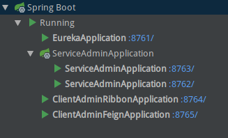
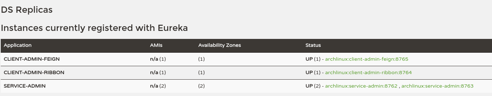
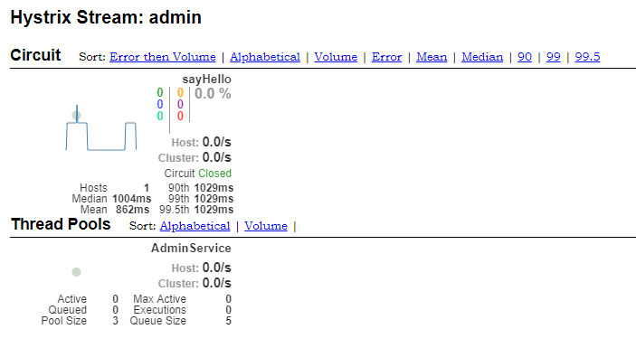

# spring-cloud-sample

解释： 在 Spring Cloud 微服务系统中，一种常见的负载均衡方式是，客户端的请求首先经过负载均衡（Zuul、Ngnix），再到达服务网关（Zuul 集群），然后再到具体的服。服务统一注册到高可用的服务注册中心集群，服务的所有的配置文件由配置服务管理，配置服务的配置文件放在 GIT 仓库，方便开发人员随时改配置。
#### 技术要点
- Maven
- Spring Boot
- Eureka 服务注册中心
- Ribbon 服务消费者
- Feign 服务消费者 
- Hystrix 熔断器
- Hystrix 熔断器仪盘表监控
- Zuul API网关

#### 部分运行截图
- 服务开启  
  
  

- 熔断器仪盘表  

#### 推荐李卫民老师的教学视频
地址：[李卫民老师的个人博客](http://blog.funtl.com:8080/2018/04/07/contents/Java-%E5%BE%AE%E6%9C%8D%E5%8A%A1%E6%9E%B6%E6%9E%84/)

#### 待解决的问题
- Zuul 网关路由回调失效